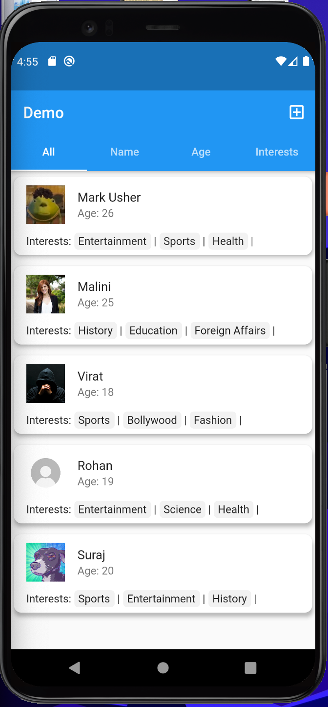

# Demo
 A demo app.

## Screenshots:




## How to Use 

**Step 1:**

Download or clone this repo by using the link below:

```
https://github.com/XerXes100/demo.git
```

**Step 2:**

Go to project root and execute the following command in console to get the required dependencies: 

```
flutter pub get 
```

**Step 3:**

Run the app using either the emulator or a physical device if possible
```
flutter run 
```

